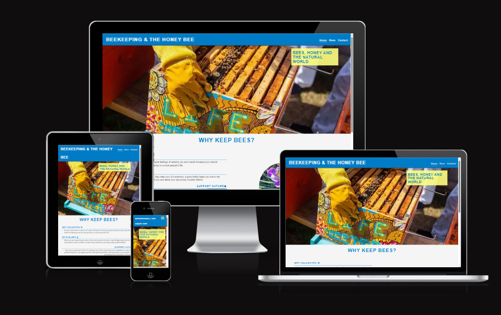
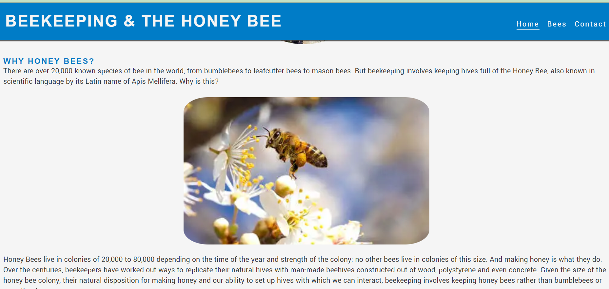
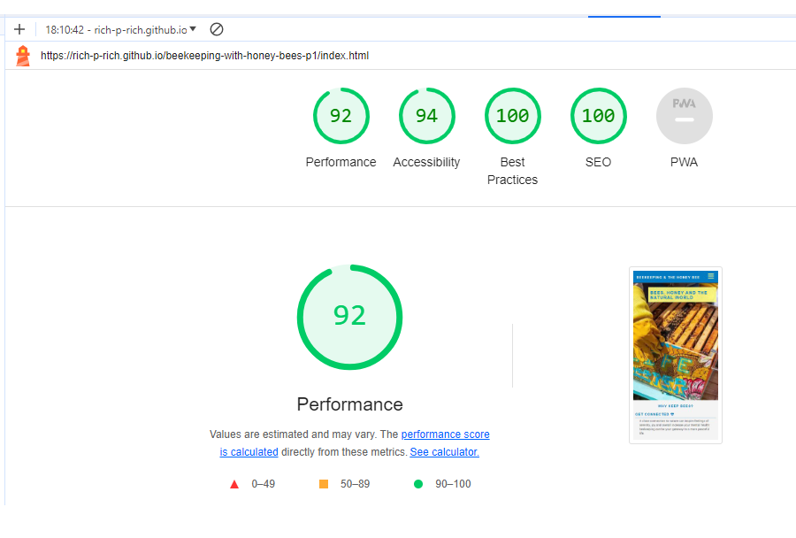
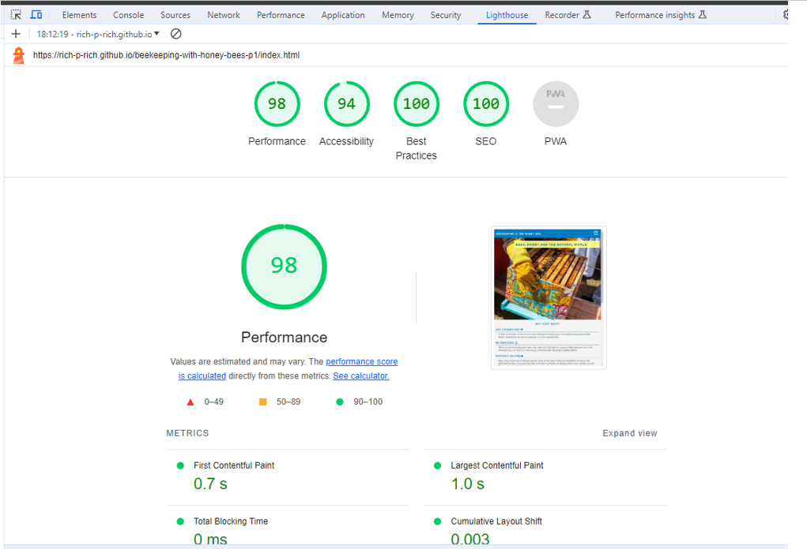
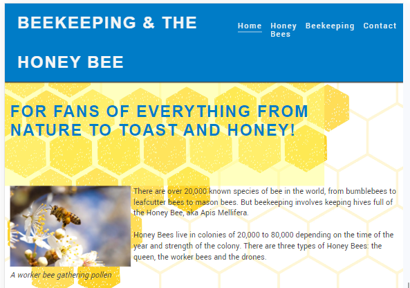
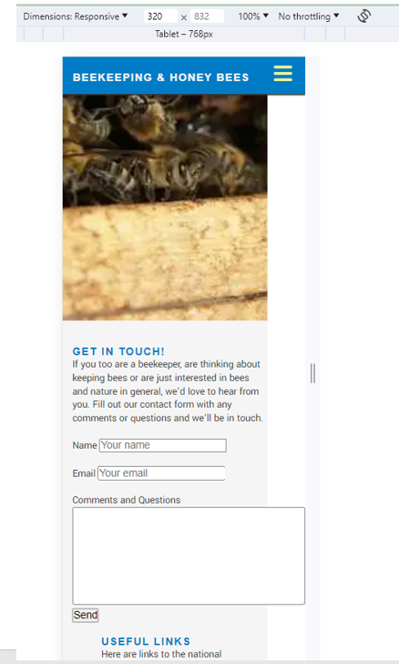
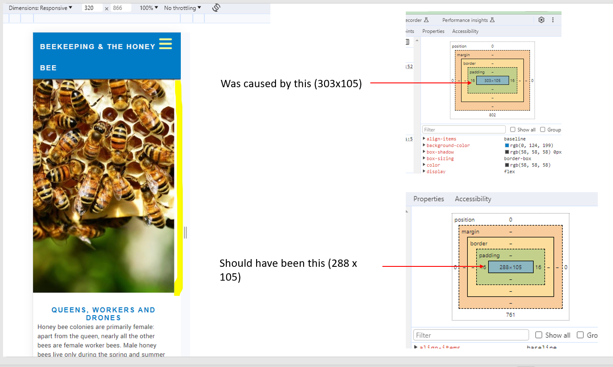

# Beekeeping with the Honey Bee: Introduction

This website is designed to offer a window into the world of beekeeping
with the honey bee. I have been beekeeping for just over five years and I well remember many of the basic questions I had before I started the hobby, such as what is the difference between honey bees and bumblebees, what is in a beehive, and how do you actually get the honey?! With this website, I answer the most basic questions about the bees to help people who are completely new to the hobby find their feet. This is also why I have included 'honey bee' in the title of the website: I don't think it is clear to everyone that honey bees are the specific type of bee kept by beekeepers.

I hope to answer such questions in a clear and interesting manner and my target audience is people with a general / casual interest in bees and beekeeping, and nature in general. Hopefully the site will entertain the more experienced beekeeper along the way, but they are not my target audience at this point; that would be my next step: exploring and presenting more specialised beekeeping topics that would attract practising beekeepers as well.

## Features

- **Navigation Bar**
- The navbar can be found on all four pages. It is designed to be fully responsive across mobile (small and large), tablets and laptops / desktops.
- It has a clicklable logo, and links to the home, bee and contact pages.
- The navbar is accessible via a three bar 'burger' for screens up to 767 pixels
- For bigger screens, the individual pages are accessible directly via the navbar
- The navbar is designed to help users easily navigate from page to page across all devices.
- The fourth 'thank you' page is deliberately not listed in the navbar as this page should only be accessed by people filling out the form on the contact page.

- **The Home Page**

  - Visitors to the website are met with a bright image of a beekeeper's hands opening a bright and colourful bee box, with some cover text that conveys what the site is all about.
  - They are then shown the question 'Why keep bees' with four reasons for doing so.
  - Additionally, I have added a short section to answer the quesion 'Why Honey Bees?' for those who may be asking that question themselves.
  - The structure of the 'reasons' section changes on laptop screens and larger to use up the available space.

- **The Bee Page**

  - The Bee page introduces the visitor to the three types of honey bee: queen, drone and worker.
  - Each bee type gets its own section with an image, a short text to sum up the key characteristics, and then 'pass notes' in bullet-point form to give more detail
  - I have also added one section between the queen and worker bees in order to acknowledge their close relationship and to transition from one section to the next.
  - This section is valuable to the user as it shows and identifies the different physical characteristics, roles and behaviour of each type of bee.
  - When I started beekeeping, I was unaware of most of this information and, from speaking to friends about my hobby, it is clear that this is normal.

- **Contact Page**

  - This page is intended as a portal for those who have any questions about the hobbey; in the long-run, it would also be a place to sign up for a newsletter that offers monthly and seasonal hints and tips for beekeepers of all levels of experience.
  - For the purposes of this project, I have created a simple contact form with name and email as mandatory fields, and an optional 'comments and questions' box.
  - As there is no back-end, I have linked the form to a 'Thank You' page to acknowledge that the form has worked.
  - I have also included some links to the national beekeeping associations of Ireland, the UK and Germany, plus an informative US website and an entertaining YouTube channel about beekeeping.
  - Why Ireland, the UK and Germany? I live in Germany, I was born and grew up in London, and much of my family is Irish and live there!

- **The Thank You page**

  - This page is designed just to acknowledge that the formon the contact page has worked.
  - I have included a friendly image of a beekeeper on a sunny day smiling at a camera, and a short text thanking the visitor for their message, and a link back to the homepage.
  - This is intended to leave a good impression on the visitor and encourage them to return.

- **The Footer**
  - The footer section includes links to a 'branded' instagram page which visitors could follow and interact with.
  - I have added links to YouTube and Facebook in case this is something I would like to develop in the future.
  - The footer is valuable to the user as it encourages them to keep connected via social media.

## Features Left to Implement

I would like to complete pages on the following:

- Homepage: two additional images to display either side of the honey bee image to fill out the space either side of it on larger screens
  
- Beekeeping equipment and schedule: this would go from the basic beekeeping equipment you need to get started to more specialist equipment for harvesting honey and treating varroa mites which are a major pest and long-term threat to the survival of the European Honey Bee.
- A gallery of images and videos about bees and beekeeping, together with videos of my bees in their hives.
- Swarm page: information on why bees swarm, how to prevent (discourage) it as a beekeeper, what to do if you find one and videos of swarms in action
- Honey: information on how to harvest honey, when to harvest and how much to leave, the different types of honey and how to store it.
- Winter: many people ask me what bees do over winter, when it snows, etc, so I would address these questions on a separate page.

## Validator Testing

- HTML
  - All errors which were found when I checked the HTML code with the W3C validator have been fixed
  - Method of checking: direct input
  - Source: [W3C validator](https://validator.w3.org/nu/?doc=https%3A%2F%2Fcode-institute-org.github.io%2Flove-running-2.0%2Findex.html)
- CSS
  - All errors which were found when I checked the CSS code with the jigsaw css validaotr have been fixed
  - Method of checking: direct input
  - [(Jigsaw) validator](https://jigsaw.w3.org/css-validator/validator?uri=https%3A%2F%2Fvalidator.w3.org%2Fnu%2F%3Fdoc%3Dhttps%253A%252F%252Fcode-institute-org.github.io%252Flove-running-2.0%252Findex.html&profile=css3svg&usermedium=all&warning=1&vextwarning=&lang=en#css)

## Lighthouse testing

I tested the website withe the Dev Tools Lighthouse tester and the performce for both mobile and desktop is now above 90 for all pages. I have included screenshots of all test results in the documentation folder -> lighthouse testing subfolder.
As can be seen the first batch of testing yielded a performance score of between 60 and 70. This was due to the size of the images I was using: although I had compressed the images using tinypng.com, the images were still too big. Therefore, I resized all of my images with iloveimg.com, and then converted them to webpt images with cloudconvert.com. After I replaced the old website images with this new ones, the lighthouse score went up above 90 in each case.

## Testing: appearance and functionality

- Testing done on Chrome, Firefox, Samsung Internet version 23.0.1.1 on a Samsung A33.
- Mobile testing included portrait and landscape views.
- Link used: https://rich-p-rich.github.io/beekeeping-with-honey-bees-p1/index.html
- Also used for testing: Chrome Dev tools

| Test                                              | Expected outcome                                    | Result |
| ------------------------------------------------- | --------------------------------------------------- | ------ |
| Navbar - home - click logo                        | Refresh page                                        | Pass   |
| Navbar - click burger bar (mobile only)           | Opens navigation                                    | Pass   |
| Hompage navbar - click Home button                | Refresh page                                        | Pass   |
| Hompage navbar - click Bees button                | Navigate to bee page                                | Pass   |
| Hompage navbar - click Contact button             | Navigate to contact page                            | Pass   |
| Homepage - image formatting (mobile)              | Comfortably Fits frame                              | Pass   |
| Homepage - text formatting (mobile)               | Comfortably Fits frame                              | Pass   |
| Homepage - image formatting (tablet)              | Comfortably Fits frame                              | Pass   |
| Homepage - text formatting (tablet)               | Comfortably Fits frame                              | Pass   |
| Homepage - image formatting (laptop plus)         | Comfortably Fits frame                              | Pass   |
| Homepage - text formatting (laptop plus)          | Comfortably Fits frame                              | Pass   |
| Homepage - laptop format - reasons section        | The structure of this section expands to fill space | Pass   |
| Homepage - laptop format - honey bee section      | The honey bee image expands to fill space           | Pass   |
| Homepage - reponsive for mobile - tablet          | Text and images are responsive                      | Pass   |
| Homepage - reponsive for tablet - laptop          | Text and images are responsive                      | Pass   |
| Beepage navbar - click burger bar (mobile)        | Opens navigation                                    | Pass   |
| Beepage navbar - click Home button                | Goes to home page page                              | Pass   |
| Beepage navbar - click Bees button                | Refreshes page                                      | Pass   |
| Beepage navbar - click Contact button             | Goes to contact page                                | Pass   |
| Beepage - image formatting (mobile)               | Comfortably Fits frame                              | Pass   |
| Beepage - text formatting (mobile)                | Comfortably Fits frame                              | Pass   |
| Beepage - image formatting (tablet)               | Comfortably Fits frame                              | Pass   |
| Beepage - text formatting (tablet)                | Comfortably Fits frame                              | Pass   |
| Beepage - image formatting (laptop plus)          | Comfortably Fits frame                              | Pass   |
| Beepage - text formatting (laptop plus)           | Comfortably Fits frame                              | Pass   |
| Beepage - reponsive for mobile - tablet           | Text and images are responsive                      | Pass   |
| Beepage - reponsive for tablet - laptop           | Text and images are responsive                      | Pass   |
| Contact page navbar - click burger bar (mobile)   | Opens navigation                                    | Pass   |
| Contact page navbar - click Home button           | Goes to home page page                              | Pass   |
| Contact page navbar - click Bees button           | Goes to bee page                                    | Pass   |
| Contact page navbar - click Contact button        | Refreshes page                                      | Pass   |
| Contact page - image formatting (mobile)          | Comfortably Fits frame                              | Pass   |
| Contact page - text formatting (mobile)           | Comfortably Fits frame                              | Pass   |
| Contact page - image formatting (tablet)          | Comfortably Fits frame                              | Pass   |
| Contact page - text formatting (tablet)           | Comfortably Fits frame                              | Pass   |
| Contact page - image formatting (laptop plus)     | Comfortably Fits frame                              | Pass   |
| Contact page - text formatting (laptop plus)      | Comfortably Fits frame                              | Pass   |
| Contact page - reponsive for mobile - tablet      | Text and images are responsive                      | Pass   |
| Contact page - reponsive for tablet - laptop      | Text and images are responsive                      | Pass   |
| Contact page - contact form - name & email        | Name and email are mandatory                        | Pass   |
| Contact page - contact form - name & email        | Message is optional                                 | Pass   |
| Contact page - contact form - click send          | Goes to Thank You page                              | Pass   |
| Thank you page navbar - click burger bar (mobile) | Opens navigation                                    | Pass   |
| Thank you page navbar - click Home button         | Goes to home page page                              | Pass   |
| Thank you page navbar - click Bees button         | Goes to bee page                                    | Pass   |
| Thank you page navbar - click Contact button      | Goes to contact page                                | Pass   |
| Thank you page - image formatting (mobile)        | Comfortably Fits frame                              | Pass   |
| Thank you page - text formatting (mobile)         | Comfortably Fits frame                              | Pass   |
| Thank you page - image formatting (tablet)        | Comfortably Fits frame                              | Pass   |
| Thank you page - text formatting (tablet)         | Comfortably Fits frame                              | Pass   |
| Thank you page - image formatting (laptop plus)   | Comfortably Fits frame                              | Pass   |
| Thank you page - text formatting (laptop plus)    | Comfortably Fits frame                              | Pass   |
| Thank you page - reponsive for mobile - tablet    | Text and images are responsive                      | Pass   |
| Thank you page - reponsive for tablet - laptop    | Text and images are responsive                      | Pass   |
| Thank you page - text link to home page           | Leads to homepage                                   | Pass   |
| Footer - Instagram image - clickability           | Leads to related IG account                         | Pass   |
| Footer - Youtube image - clickability             | Leads to YouTube homepage                           | Pass   |
| Footer - Facebook image - clickability            | Leads to YouTube homepage                           | Pass   |

## Notable challenges and bugs (fixed)

I encountered many difficulties and bugs while putting this website together. Some of the noteworthy ones are as follows:

- I originally thought adding a honeycomb-style background to the website pages would be a good idea. However, the images proved slow to load and did not interact well with the content; I tried three different styles but the text contrast was sometimes poor, the image content did not always match well with the background and they required extensive additional media queries to have them work properly. I decided that although they looked good, they did not work well on the website and deleted them in favour of a plain 'whitesmoke' background.
- 
- I had trouble making my footer stick to the bottom of all the pages. I originally thought it would be a nice idea to have the footer always visible when scrolling on a mobile device, but the reality was not good: it distracted from the body of the text and my implementation moving from mobile to tablet and desktop did not work well. I struggled to make the footer work until I realised that I had not properly articulated the 'min-height' value in CSS for 100vh. Once I had done this, the footer worked properly.
- Margin-top: I realised in testing that the margin top was inconsistent when the text in the header went over two lines. I solved this by creating media queries for quite niche sizes (e.g. 373px - 378px) because otherwise the cover text was either too low down, or covered by the header
- Header over-hang on the contact page: I had two problems here. The first was fairly simple - I just had to reduce the width of the comments box. Previously, it looked like this:
- 
- I had help from the tutoring team to help me resolve a problem on my contact page where the header was hanging over on the right of the page by just a few pixels. After trying a number of solutions, the tutoring team suggested that I remove the margin of some text in the body which solved the prolem immediately.
  
- I also got severely stuck with a GitMerge problem which the tutoring service helped me with, walking me through the steps back to normality.

## Unfixed Bugs

- I found on Firefox testing that the margins on my bee page and contact page are not as good as they are on the Chome: this is specifically to do with the margin between the header and the 'queens, workers and drones' H2 text (all device sizes), the text and the contact form on the contact page (mobile size) and the contact form and the send button (all device sizes). Although this detracts slightly from the presentation of the site, I do not regard it as a critical fix before submitting this project. It is however something I would like to fix if I should take this website forward and publish it.

## Deployment

I deployed the site to GitHub pages for the first time on 13.12.2023. I followed the steps outlined in the guidance:

- From the GitHub repository -> Settings tab
- Select pages
- Set source to 'Deploy from Branch'
- Select main folder
- Folder set to / (root)

The live link can be found here - <https://rich-p-rich.github.io/beekeeping-with-honey-bees-p1/>

## Credits

- Thank you to my mentor Dick Vlaanderen for valuable support and advice.
- Thank you to the tutoring service who helped me out of some very difficult spots when I got stuck, especially with the git merge problem and the header overhang.

### Coding help:

I used the 'Love Running' project and advice on the CodeInstitute website significantly. Additionally:

https://www.w3schools.com/ -> specifically (but not only these pages - more were consulted)

- <https://www.w3schools.com/howto/howto_css_rounded_images.asp>
- <https://www.w3schools.com/css/css_rwd_images.asp>
- https://www.w3schools.com/html/html_images_background.asp
- <https://www.w3schools.com/howto/howto_css_images_side_by_side.asp>
- <https://www.w3schools.com/css/css_font_size.asp>
- <https://www.w3schools.com/html/html_links.asp>
- <https://www.w3schools.com/html/html_layout.asp>
- <https://www.w3schools.com/howto/howto_css_full_page.asp>
- <https://www.w3schools.com/howto/howto_css_fixed_footer.asp>
- <https://www.w3schools.com/css/css3_object-fit.asp#:~:text=object%2Dfit%20Property-,The%20CSS%20object%2Dfit%20property%20is%20used%20to%20specify%20how,as%20much%20space%20as%20possible%22>
- <https://www.w3schools.com/css/css_positioning.asp>
- <https://www.w3schools.com/html/html_css.asp>
- <https://www.w3schools.com/howto/howto_css_hero_image.asp>
- <https://www.w3schools.com/html/html_images.asp>
- <https://www.w3schools.com/css/css_text.asp>
- <https://www.w3schools.com/colors/colors_picker.asp>

https://stackoverflow.com/ -> specifically (but not only these pages were consulted)...

- <https://stackoverflow.com/questions/57349315/how-do-i-make-the-hero-image-resize-on-width-correctly>
- <https://stackoverflow.com/questions/42699978/how-to-view-media-queries-with-google-chrome-dev-tool-or-firefox-dev-tool>
- <https://stackoverflow.com/questions/11699847/css-centering-of-an-image-not-working>
- https://stackoverflow.com/questions/5214893/right-align-an-image-using-css-html
- <https://stackoverflow.com/questions/32494645/header-image-too-wide-for-mobile-screens>
- <https://stackoverflow.com/questions/17966390/how-do-i-make-a-field-required-in-html>
- https://stackoverflow.com/questions/57349315/how-do-i-make-the-hero-image-resize-on-width-correctly
- https://stackoverflow.com/questions/13609006/floating-footer-always-on-the-bottom-and-visible
- <https://stackoverflow.com/questions/5976289/stretch-text-to-fit-width-of-div>
- <https://stackoverflow.com/questions/29928016/click-an-image-to-reveal-content>
- https://stackoverflow.com/questions/68762647/header-not-responsive-causing-overlap-on-buttons

### Validators:

- https://validator.w3.org/
- https://jigsaw.w3.org/css-validator/

### ReadMe advice:

- https://github.com/Code-Institute-Solutions/readme-template
- https://www.youtube.com/watch?v=Q66HZgkDSOo
- https://www.youtube.com/watch?v=HUBNt18RFbo (found on Slack community page)
- https://www.markdownguide.org/basic-syntax/#images-1

### Content and Design

- The icons for the navbar 'burger' and the Intagram image in the footer were taken from [Font Awesome](https://fontawesome.com/)
- The fonts were taken from [Google Fonts] https://fonts.google.com/
- Inspiration for website colours and accessibility:
  https://webflow.com/blog/elegant-color-palettes
  https://visme.co/blog/website-color-schemes/
  https://hookagency.com/blog/website-color-schemes/

### Media

- Credits for the images are commented inline when they appear
  For optimising photos on the website, I used:
- https://tinypng.com/
- https://www.iloveimg.com/resize-image
- https://cloudconvert.com/jpg-to-webp
